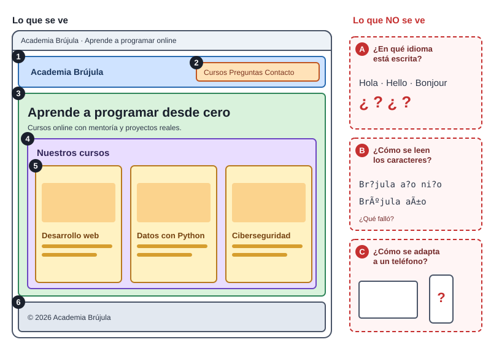
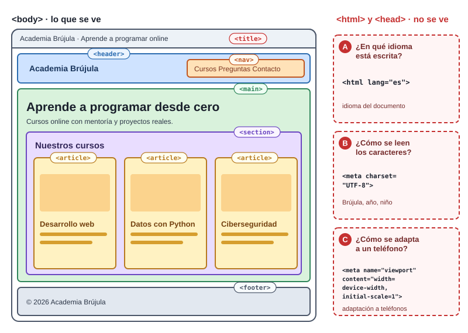
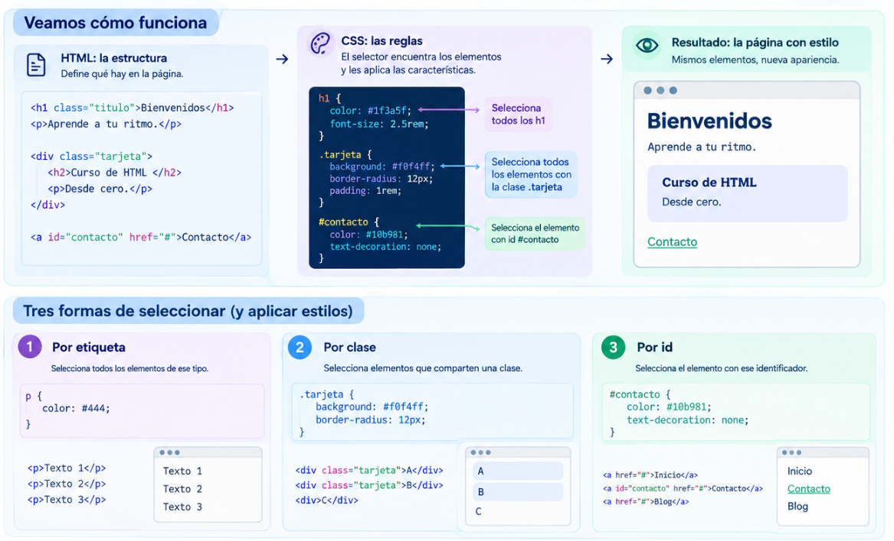

# Interfaces con HTML y CSS, accesibles y descubribles: verificar lo que propone la IA

<!-- *Clase práctica · Módulo «Desarrollando interfaces con HTML y CSS, accesibles y aplicando SEO/GEO» · Curso de AI Engineering*

---

## Antes de empezar: de qué trata realmente esta clase -->

Hoy una IA puede escribirte una página web completa en diez segundos. Lo difícil ya no es producir código. Lo difícil es saber si ese código está bien.

Pasar de esto:

> «La IA me generó este código y parece correcto.»

a esto:

> «La IA me generó este código. Entiendo qué debería hacer, puedo detectar si está bien, puedo explicar por qué y puedo corregirlo.»

<!-- Ese es el objetivo. HTML, CSS, SEO y accesibilidad son el terreno donde vamos a entrenarlo, porque son temas donde el código **se ve bien y puede estar mal**. Una página puede lucir perfecta y ser inutilizable con teclado, muda para un lector de pantalla e ilegible para un buscador. -->

<!-- Durante la clase repetirás varias veces el mismo ciclo de trabajo:

**La IA propone, vos verificás.**

> generar → inspeccionar → cuestionar → verificar → corregir

Y cada concepto nuevo se trabaja con este recorrido:

> problema → hipótesis → concepto → construcción → error → verificación → recuperación → transferencia

Una regla de uso: **no mires las respuestas antes de intentar.** Las respuestas están escondidas a propósito. Equivocarte antes de ver la solución es lo que hace que la solución se quede.

### Qué necesitas

- Un editor de código (el de tu Codespace sirve) y un navegador.
- Un archivo `index.html` y otro `styles.css` vacíos.
- Papel o un bloc de notas para anotar tus hipótesis.

--- -->

<!-- ## El modelo mental de las cuatro lecciones -->

Una página web existe para tres públicos a la vez: el navegador, las máquinas que la interpretan (buscadores y asistentes de IA) y las personas, todas. Cada lección responde una pregunta:

| Lección | Pregunta que responde |
|---|---|
| HTML | ¿Qué es cada cosa? |
| CSS | ¿Cómo se presenta? |
| SEO/GEO | ¿Cómo pueden entenderlo las máquinas? |
| Accesibilidad | ¿Cómo pueden usarlo distintas personas? |

La idea que une todo, y que vas a descubrir tú mismo más adelante: **una misma decisión bien tomada beneficia a varios públicos a la vez.**

<!-- ### Proyecto conductor: Academia Brújula

Construirás la portada de **Academia Brújula**, una academia de programación online. Tendrá encabezado con navegación, un título principal, una lista de cursos y un formulario de contacto. La misma página crecerá en cada lección: primero estructura, luego presentación, luego descubribilidad y finalmente acceso universal.

--- -->

## HTML: decirle a la máquina qué es cada cosa

<!-- ### Problema

Quieres dictarle por teléfono tu página a alguien que no puede verla.

### Piénsalo

Antes de seguir, escribe en tu cuaderno cómo describirías la portada de Academia Brújula en cinco frases, sin decir colores ni tamaños. Solo **qué hay**.

Seguramente escribiste algo como «hay un menú, un título grande, una lista de cursos, un formulario y un pie de página». Describiste **significado**, no apariencia. Eso es exactamente lo que hace HTML.

### Concepto -->

HTML es un lenguaje de **marcado**: rodea contenido con etiquetas que dicen qué es. No decide cómo se ve; eso le toca a CSS. No programa; etiqueta.

```html
<p class="intro">Aprende a programar con acompañamiento real.</p>
```

- `<p>` y `</p>` abren y cierran el elemento.
- `class="intro"` es un **atributo**: información extra.
- El texto es el **contenido**.

### Pregunta: 

Si tuvieras que explicarle al navegador qué es cada parte de esta página, ¿cómo la clasificarías?



### Descubre las etiquetas reales
 
HTML tiene una etiqueta pensada para cada una de esas zonas. Relaciona cada número con su etiqueta:
 
| Zona | Etiqueta |
|---|---|
| 1 · Cabecera | ? |
| 2 · Navegación | ? |
| 3 · Contenido principal | ? |
| 4 · Bloque temático con su propio título | ? |
| 5 · Contenido independiente que se entiende solo | ? |
| 6 · Pie de página | ? |
 
Opciones: `<article>`, `<footer>`, `<header>`, `<main>`, `<nav>`, `<section>`.
 
Cuando termines, revela la solución en la imagen:

<details>
<summary>Ver solución</summary>



</details>


¿Qué etiquetas están **dentro** de otras? ¿Eso coincide con lo que anotaste?

 > Una pista para elegir entre `<section>` y `<article>`: si puedes sacar el bloque de la página y sigue teniendo sentido por sí solo (una tarjeta de curso, una noticia), probablemente es un `<article>`. Si es un grupo temático que necesita su título para tener sentido, es una `<section>`.

### Comunicar lo que no se ve
 
Lo que hicimos permite reconocer la estructura visual, pero no revela toda la información que necesita el navegador. Mira de nuevo la columna derecha de la primera imagen, «Lo que NO se ve».
 
Responde con tus palabras:
 
- **A.** ¿Cómo le indicarías en qué idioma está escrita la página?
- **B.** ¿Cómo le indicarías cómo interpretar los caracteres, para que «Brújula» no se vea como «Brújula»?
- **C.** ¿Cómo le indicarías que adapte su visualización a un teléfono?
No hace falta que sepas escribir el código exacto. Responde qué tendría que decirle la página al navegador. Después, compara con el código:
 
```html
<!DOCTYPE html>
<html lang="es">
  <head>
    <meta charset="UTF-8">
    <meta name="viewport" content="width=device-width, initial-scale=1">
    <title>Academia Brújula · Aprende a programar online</title>
  </head>
  <body>
    <!-- aquí va todo lo que hicimos en la sección "Descubre las etiquetas reales"  -->
  </body>
</html>
```
 
| Línea | Qué comunica | Quién se beneficia |
|---|---|---|
| `lang="es"` | El idioma del documento | Lectores de pantalla (pronunciación) y buscadores |
| `charset="UTF-8"` | Cómo interpretar los caracteres | Todas las personas: tildes y ñ se leen bien |
| `viewport` | Cómo adaptar la página a pantallas pequeñas | Quien visita desde un teléfono |
| `<title>` | El nombre de la página | La pestaña, los resultados de búsqueda y los favoritos |
 
Y la distinción importante: `<head>` guarda información **sobre** la página y casi toda es invisible; `<body>` guarda lo que **se ve**. El `<title>` es la excepción interesante: viene de `<head>`, pero lo ves en la pestaña.
 

### Los títulos son un índice, no un tamaño

**Los encabezados (`<h1>` a `<h6>`) organizan el contenido en niveles, como los títulos de un libro.** `<h1>` representa el título principal; `<h2>`, las secciones; y `<h3>`, las subsecciones. Puede haber más de un `<h1>` en una página, pero para comenzar, utilizaremos uno principal y mantendremos una jerarquía lógica, sin saltar niveles innecesariamente.


### Error para detectar 1: la IA generó esto, ¿lo aceptarías?

Le pediste a una IA la sección de cursos y devolvió:

```html
<h1>Curso</h1>
<h4>Lecciones</h4>
<h4>Precio</h4>
```

Antes de seguir: 1) ¿qué ves de raro?, 2) ¿a quién le afecta?, 3) ¿cómo lo corregirías?, 4) ¿cómo lo comprobarías?

<details>
<summary>Ver análisis</summary>

Se salta de `<h1>` a `<h4>`. Quien navega por títulos con un lector de pantalla encuentra un índice con agujeros, y los buscadores entienden peor la jerarquía. Probablemente la IA eligió `<h4>` por su tamaño visual. La corrección es usar `<h2>` y dejar el tamaño para CSS. Se verifica con el validador de HTML del W3C, con el panel de accesibilidad de las DevTools o revisando el esquema de títulos.
</details>

### Error para detectar 2: un botón que no es un botón

```html
<div onclick="enviarFormulario()">Enviar</div>
```

Piensa en tres preguntas: ¿esto es realmente un botón?, ¿qué ocurre si alguien usa solo el teclado?, ¿qué alternativa propondrías?

Hipótesis primero. Después, comprueba tú mismo: crea una página con este `<div>` y otra con `<button>Enviar</button>`, presiona Tab en cada una y observa cuál recibe el foco y responde a Enter.

<details>
<summary>Ver explicación</summary>

El `<div>` no recibe foco, no responde a Enter ni a Espacio y para un lector de pantalla no es un botón. Un `<button>` lo trae todo incluido: foco, teclado y significado. Regla práctica: **usa primero el elemento nativo.** Si la acción cambia de página, es un `<a>`; si ejecuta algo, es un `<button>`.
</details>


## CSS: separar el significado de la apariencia


Si HTML define qué es cada elemento de una página, ¿dónde crees que deberíamos definir cómo se ve? Imagina un libro: HTML sería su contenido y CSS, el diseño editorial que determina la tipografía, los colores y la distribución del texto.

### Concepto mínimo

```html
<link rel="stylesheet" href="styles.css">
```

Va dentro de `<head>`.




### Tu turno 1: la cascada

Esta es la situación:

```css
p { color: blue; }
.destacado { color: green; }
```

```html
<p class="destacado">¿De qué color se ve?</p>
```

Anota tu predicción, aplícalo y comprueba con las DevTools (F12): inspecciona el párrafo y mira qué regla aparece tachada.

<details>
<summary>Ver explicación</summary>

Se ve verde. Cuando dos reglas chocan, gana la más **específica**: una clase pesa más que una etiqueta. Si empatan, gana la que aparece después. Cuando tu estilo «no se aplica», no pelees con el código: inspecciona y mira qué regla está ganando.
</details>

### Tu turno 2: padding o margin

Una tarjeta de curso tiene el texto demasiado pegado a sus bordes internos. ¿Usarías `margin` o `padding`? ¿Por qué?

Ahora quieres separar esta tarjeta de la siguiente. ¿Cuál usarías?

<details>
<summary>Ver respuesta</summary>

Para separar el texto del borde, **padding** (espacio interno). Para separar la tarjeta de otra, **margin** (espacio externo). Todo elemento es una caja de cuatro capas, de adentro hacia afuera: contenido, padding, borde y margin. Una línea que evita sorpresas con los anchos:

```css
*, *::before, *::after { box-sizing: border-box; }
```
</details>

### Tu turno 3: el menú en una fila

Tienes un menú con cuatro enlaces dentro de una lista. Se muestran en vertical y los quieres en una fila. ¿Cómo intentarías resolverlo? Anota una idea antes de seguir.

Ahora sí: CSS tiene una herramienta diseñada para este problema.

```css
nav ul {
  display: flex;
  gap: 1.5rem;
  list-style: none;
  padding: 0;
}
```

**Flexbox** ordena elementos en una dimensión (fila o columna). 

### Tu turno 4: una decisión con consecuencias

Un texto en `px` y otro en `rem`. Una persona con baja visión agranda el tamaño de letra de su navegador. ¿Qué crees que pasa con cada uno? Pruébalo: cambia el tamaño de fuente en la configuración de tu navegador y observa.

<details>
<summary>Ver explicación</summary>

El texto en `rem` se ajusta a la preferencia de la persona; el de `px` la ignora. Una decisión de CSS tiene consecuencias de accesibilidad. Úsalo para texto y espacios.
</details>

### Error para detectar 3: CSS que parece limpio

```css
a { outline: none; }
```

La IA lo agregó «para que se vea más limpio». ¿Qué problema puede crear? Antes de leer la respuesta, haz una prueba: aplícalo, recorre la página con Tab y pregunta si puedes saber dónde estás.

<details>
<summary>Ver explicación</summary>

Quita el indicador de foco, y quien navega con teclado queda a ciegas. No se elimina: se reemplaza.

```css
a:focus-visible {
  outline: 3px solid #ffbf47;
  outline-offset: 2px;
}
```
</details>

### Mobile first, en una línea

Diseña primero para la pantalla pequeña y amplía después con `@media (min-width: 48rem) { ... }`. Es más simple y casi siempre refleja cómo te visitan.

### Verificación

Abre las DevTools, activa el modo móvil, cambia el ancho de pantalla y observa si algo se rompe o aparece scroll horizontal.

### Desafio

Una página de noticias muestra tarjetas con foto, título y resumen, en una columna en el teléfono y en tres en escritorio. Sin mirar tu código de Academia Brújula, ¿qué herramienta de disposición usarías y por qué?

### Recuerda sin mirar

- Un colega te dice que su estilo no se aplica. ¿Cuál es tu primera acción y qué esperas encontrar?
- Para el texto de una página, ¿`px` o `rem`? ¿Qué persona se ve afectada por tu decisión?


## SEO y GEO: dar señales claras a las máquinas

Construiste una página excelente y nadie la encuentra. Y cada vez más gente no pregunta a un buscador, sino a un asistente de IA que responde con texto.

### Piénsalo

Un rastreador visita tu página. No ve tu diseño ni tus colores. ¿Qué crees que lee? Si fueras tú el rastreador, ¿qué señales buscarías para decidir de qué trata una página?

**Las máquinas necesitan señales claras para entender nuestro contenido.**

- **SEO** (*Search Engine Optimization*): ayudar a que los buscadores entiendan tu página y la muestren a quien busca algo relacionado.
- **GEO** (*Generative Engine Optimization*): ayudar a que los asistentes de IA entiendan tu contenido y puedan tomarlo como fuente.

No es un conjunto de trucos. Es escribir de forma clara, estructurada y verificable.

### Fundamental: cinco señales que ya conoces

| Señal | Qué comunica | Mala práctica |
|---|---|---|
| `<title>` | De qué trata la página | «Inicio» |
| `<h1>` y títulos | Tema y organización | Títulos saltados o por tamaño |
| Texto del enlace | Adónde lleva | «Haz clic aquí» |
| `alt` en imágenes | Qué muestra la imagen | Ausente o «imagen» |
| HTML semántico | Rol de cada zona | Todo en `<div>` |

### Tu turno 1: reescribe el título

La página de Academia Brújula tiene `<title>Inicio</title>` y la meta descripción vacía. Escribe un título (idealmente de unos 60 caracteres) y una descripción (unos 150-160) pensando en alguien que ve ese resultado entre diez más y decide si hacer clic.

```html
<meta name="description" content="...">
```

<details>
<summary>Ver una posible respuesta</summary>

`<title>Academia Brújula · Cursos de programación online para principiantes</title>`

`<meta name="description" content="Aprende a programar desde cero con mentoría y proyectos reales. Cursos online de desarrollo web para principiantes.">`

La descripción no es un factor directo de posicionamiento, pero suele aparecer bajo el título y convence (o no) de hacer clic. Se escribe para personas.
</details>

### Error para detectar 4: la IA generó esto

```html

<a href="/curso">Haz clic aquí</a>
```

Antes de leer la respuesta: ¿qué señales faltan? ¿Qué entiende una máquina de cada línea? ¿Y un lector de pantalla?

<details>
<summary>Ver análisis</summary>

La imagen no tiene `alt` y su nombre no dice nada. El enlace no dice adónde va. Corregido:

```html

<a href="/cursos/desarrollo-web">Ver el curso de desarrollo web</a>
```

Observa que el mismo cambio ayuda a tres públicos: buscadores, asistentes de IA y personas con lector de pantalla. Eso es lo que une las lecciones.
</details>

### Actividad de descubrimiento: una decisión, varios beneficiarios

Mira esta línea:

```html
<h1>Aprende a programar desde cero</h1>
```

Haz una tabla con dos columnas: «¿Quién se beneficia?» y «¿Cómo?». Intenta encontrar al menos cuatro beneficiarios antes de leer.

<details>
<summary>Ver respuesta posible</summary>

El navegador (jerarquía), los buscadores (tema principal), los asistentes de IA (de qué trata la página), los lectores de pantalla (punto de orientación) y las personas que navegan saltando por títulos.
</details>

### Datos estructurados: una introducción

Hasta ahora diste pistas implícitas. Los datos estructurados dicen explícitamente qué es tu contenido, con un vocabulario compartido (schema.org) escrito en JSON-LD:

```html
<script type="application/ld+json">
{
  "@context": "https://schema.org",
  "@type": "Course",
  "name": "Desarrollo web inicial",
  "description": "HTML, CSS y tu primer sitio publicado.",
  "provider": { "@type": "Organization", "name": "Academia Brújula" }
}
</script>
```

Es como una etiqueta de identidad para tu contenido. Dos reglas: lo marcado debe coincidir con lo visible en la página, y conviene validarlo con las herramientas de prueba de los buscadores.

### GEO: escribir para ser citado

Un asistente de IA no muestra tu página: **elige fragmentos** y los usa para armar una respuesta. Lo que favorece que tu fragmento sea elegido:

- Responder de frente al inicio de cada sección.
- Usar preguntas reales como títulos: «¿Cuánto dura el curso?», seguida de una respuesta concreta.
- Ser específico y verificable (datos, fechas, autoría).
- Usar listas y secciones bien tituladas.

### Una advertencia honesta

Nadie puede garantizarte posiciones ni citas. Desconfía de quien lo prometa. Lo que controlas es la claridad y la calidad de lo que publicas.

### Para profundizar (no necesitas dominarlo hoy)

- **Core Web Vitals** (LCP, INP, CLS): métricas de velocidad y estabilidad. Declarar `width` y `height` en las imágenes ya ayuda a evitar saltos de diseño.
- **`robots.txt`**: indica qué puede rastrear un robot, incluidos los robots de IA.
- **`sitemap.xml`**: un mapa con las páginas que quieres que encuentren.
- **Schema.org avanzado**: más tipos de datos estructurados y resultados enriquecidos.
- **`llms.txt`**: propuesta de archivo para orientar a modelos de lenguaje. Es una iniciativa en evolución y no está garantizado que los motores la usen.
- **Contenido esencial en el HTML**: si el contenido solo aparece tras ejecutar mucho JavaScript, algunos rastreadores no lo verán.

### Verificación

Abre tu página y ponte en el lugar de la máquina: mira el código fuente (clic derecho, «Ver código fuente»). ¿Se entiende de qué trata solo leyendo el HTML? Prueba además con Lighthouse en las DevTools, que ofrece una auditoría de SEO básica.


### Recuerda sin mirar

- Un colega promete «te aseguro el puesto uno en Google». ¿Qué le responderías y qué le propondrías en cambio?
- Una IA te entrega una página con el `<title>` «Inicio» en todas las páginas del sitio. ¿Qué problema produce y cómo lo detectarías?


## Accesibilidad: que la página funcione para personas distintas

Entregaste tu página y funciona para ti. ¿Funciona para alguien que no puede usar mouse, no puede ver la pantalla o la ve en un teléfono con reflejos?

### Experiencia 1: tres minutos sin mouse

Pon un temporizador de tres minutos. Abre tu página de Academia Brújula. **No puedes tocar el mouse ni el trackpad.** Usa solo Tab, Shift+Tab, Enter y Espacio. Anota en tu cuaderno:

- ¿Qué partes puedes usar?
- ¿Qué partes no puedes alcanzar?
- ¿En qué momento no sabes dónde estás?

Ahora, antes de leer, formula una hipótesis: ¿qué decisión de HTML o de CSS podría resolver cada problema que encontraste?

<details>
<summary>Ver qué suele aparecer</summary>

Lo más frecuente: elementos que no reciben foco (`<div>` en lugar de `<button>`), foco invisible por `outline: none`, y un orden de tabulación confuso. Las soluciones coinciden con lo que ya aprendiste: elementos nativos, `:focus-visible` y un orden de HTML lógico.
</details>

### Concepto: cuatro principios

Las WCAG (*Web Content Accessibility Guidelines*), del W3C, organizan la accesibilidad en cuatro principios, conocidos por la sigla inglesa **POUR**: *Perceivable* (perceptible), *Operable* (operable), *Understandable* (comprensible) y *Robust* (robusto). La meta habitual de conformidad es el nivel **AA**.

Mantén una regla de oro: **primero HTML nativo**.


### Error para detectar: un campo de formulario

```html
<input placeholder="Correo electrónico">
```

Se ve bien. Antes de seguir, intenta responder: 1) ¿qué le falta?, 2) ¿qué pasa cuando alguien escribe?, 3) ¿cómo lo corregirías?, 4) ¿cómo lo verificarías con un lector de pantalla?

<details>
<summary>Ver análisis</summary>

El `placeholder` desaparece al escribir y no es una etiqueta confiable. Falta un `<label>` conectado:

```html
<label for="correo">Correo electrónico</label>
<input id="correo" name="correo" type="email" autocomplete="email" required>
```

Con `for` e `id`, el lector anuncia qué campo es y además el área clicable se agranda. Los mensajes de error deben decir qué falló y cómo corregirlo.
</details>

### Error para detectar: una imagen decorativa y otra informativa

```html


```

¿Qué problema tiene cada una? ¿Cuál es la regla para decidir qué escribir en `alt`?

<details>
<summary>Ver análisis</summary>

La primera es decorativa: debe llevar `alt=""` para que el lector la salte, no «imagen». La segunda informa algo y necesita un `alt` que describa su contenido o su función. Regla: pregunta si quitar la imagen cambiaría lo que la persona entiende.
</details>


## Referencias

- MDN Web Docs, guías de HTML, CSS y accesibilidad: https://developer.mozilla.org/es/
- W3C, *Web Content Accessibility Guidelines (WCAG) 2.2*: https://www.w3.org/TR/WCAG22/
- W3C, *Web Accessibility Initiative (WAI)*, tutoriales: https://www.w3.org/WAI/
- W3C, validador de HTML (Nu Html Checker): https://validator.w3.org/
- Google Search Central, guía de SEO y datos estructurados: https://developers.google.com/search
- web.dev, *Core Web Vitals*: https://web.dev/vitals/
- Schema.org, vocabulario de datos estructurados: https://schema.org/
- WebAIM, verificador de contraste: https://webaim.org/resources/contrastchecker/
